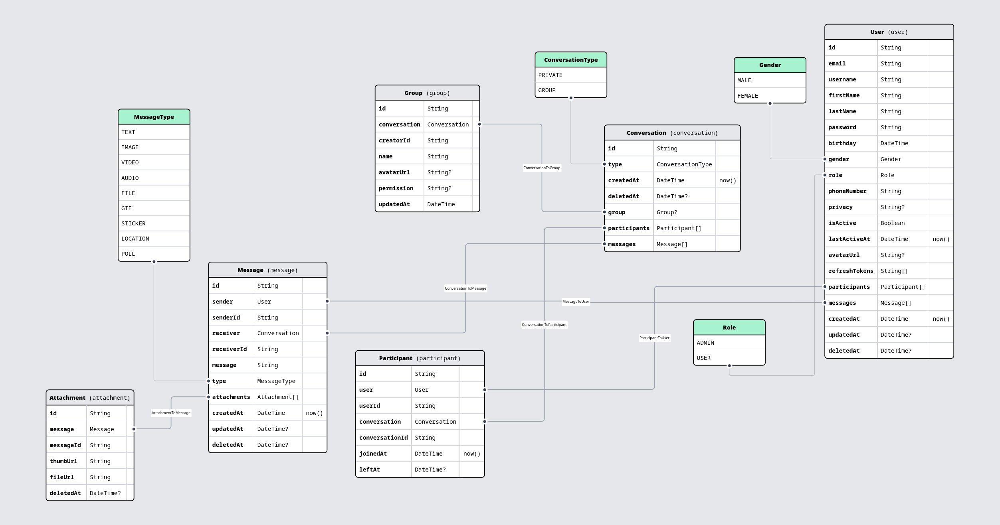

# About project

this is a service that supports messaging<br>

# Table of content

[prerequisites](#-prerequisites)<br>
[setup](#-setup)<br>
[getting started](#-getting-started)<br>
[run test (comming soon)](#-run-test)<br>
[database schema](#-database-schema)<br>
[learn more](#-learn-more)<br>
[deployment (comming soon)](#-deploy-on-vercel)<br>

## ⇁ Prerequisites

you must have npm installed<br>
database of your choice<br>

## ⇁ Setup

first, clone this project<br>
install packages:<br>

```shell
npm install
```

you need to have `.env` file in root project, in the file you need `key=value` each line. See list of required environment variables [here](#-list-of-available-environment-variables):<br>

to update your database schema, first, start your database, then run this command:

```bash
npx prisma db push
```

## ⇁ List of available environment variables

| Variable | Required | Purpose |
| -------- | -------- | ------- |

## ⇁ Getting Started

First, run the development server:

```bash
npm run dev
```

## ⇁ Run test

## ⇁ Database schema


